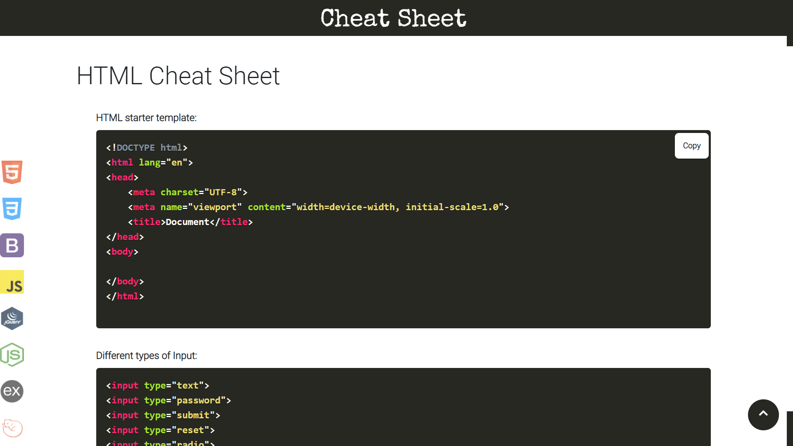
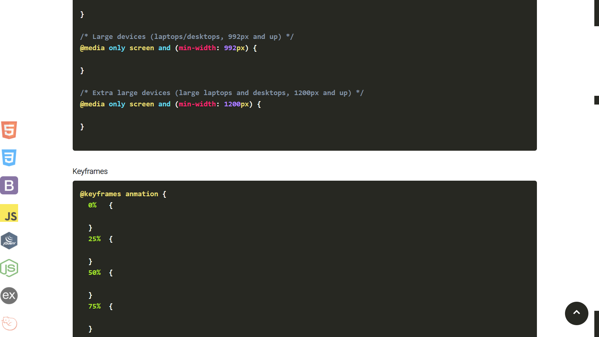
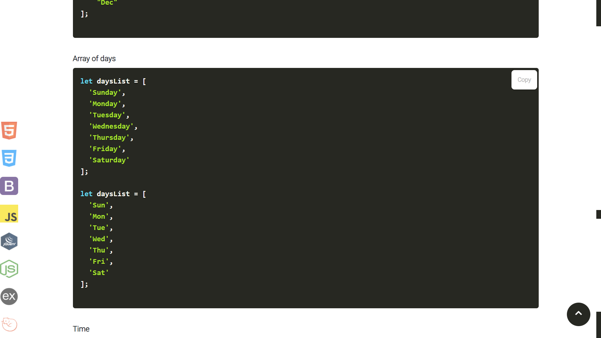

## Writing Same for every project again and again?
## Don't worry, here's my cheat sheet, you can easily copy the code.
## [Cheat Sheet](https://sagar-sharma-7.github.io/Cheat-Sheet/)

## If you want any code in this cheat sheet then please pull request or just the piece of in issues...
 

  
    
  
    
  

 

## Text Editor Used

 ## Cloning this repositary using command line
 1. Open **Git Bash**.
 1. Change the current working directory to the location where you want the cloned directory.
 1. Type `git clone `
 1. Press **Enter** to create the clone of this repositary.

 ## How to reach me?
 
 

  
 

